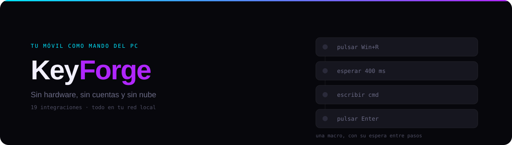
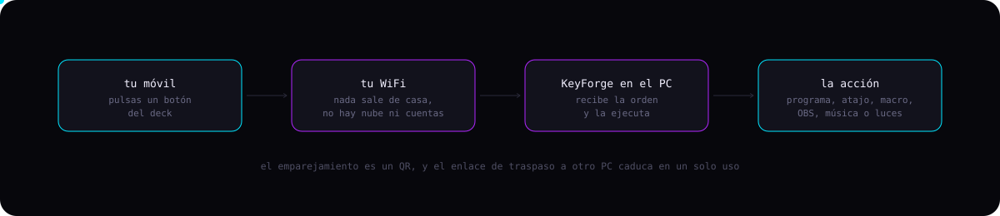

<div align="center">


</div>

Tu móvil convertido en mando a distancia para tu PC con Windows. Sin hardware, sin cuentas y sin nube. Creas botones que abren programas, pulsan atajos, controlan OBS, Spotify o tus luces. Escaneas un QR y ya está.

> [!NOTE]
> Todo corre en tu red local. No hay servidor externo, no hay registro y tus datos no salen de casa.


## Cómo funciona




## Novedades de la v2.0.0

<table>
<tr>
<td width="50%" valign="top">

### Asistente de acciones

Escribe lo que quieres, no lo que hay que configurar. Pones "bajar volumen" o "luz roja" y te sugiere qué usar, con los campos ya rellenos. La idea viene de los comandos de Minecraft.

</td>
<td width="50%" valign="top">

### Macros con espera entre pasos

`Win+R`, esperar 400 ms, escribir `cmd`, Enter. Y los combos con tecla Windows ahora funcionan de verdad, que antes se atragantaban.

</td>
</tr>
<tr>
<td width="50%" valign="top">

### Probar sin guardar

Ejecuta la macro desde el propio editor y ve al instante si hace lo que esperabas, sin tener que guardar y volver al deck.

</td>
<td width="50%" valign="top">

### Sliders de volumen

General o por programa. Arrastras en vez de dar toques hasta llegar al nivel que querías.

</td>
</tr>
</table>

**Y además:** favoritos, color por botón, modo organizar manteniendo pulsado para arrastrar como en iOS, sonido y vibración al pulsar, traspaso a otro PC por QR con enlace de un solo uso, copias de seguridad por archivo y tutorial guiado la primera vez.


## Seguridad

Aunque todo sea local, el mando abre una puerta a tu PC. Por eso:

- **PIN opcional** para entrar al deck
- **Tokens enmascarados**, que no se muestran en claro una vez guardados
- **Freno anti fuerza bruta** en los intentos de acceso
- **Aviso al importar** una copia de seguridad que contenga scripts, antes de ejecutar nada
- El **enlace de traspaso** a otro PC caduca tras un solo uso


## Las 19 integraciones

<table>
<tr>
<td width="25%" valign="top">

**Directo**

OBS Studio
Streamlabs
StreamElements
Twitch
YouTube Live
VTube Studio

</td>
<td width="25%" valign="top">

**Música y avisos**

Spotify
Discord
Telegram
ntfy

</td>
<td width="25%" valign="top">

**Luces**

Philips Hue
Home Assistant
Elgato Key Light
WLED

</td>
<td width="25%" valign="top">

**Sistema**

Volumen por aplicación
Estado del PC
Control de procesos
Webhook universal
PowerShell

</td>
</tr>
</table>

Algunas piden preparación por su parte, como activar el WebSocket en OBS o instalar SoundVolumeView para el volumen por aplicación. Cada tarjeta lo explica dentro de la propia app.


## Instalación

1. Descarga `keyforge.zip` desde la sección Releases y descomprímelo donde quieras
2. Doble clic en `Iniciar.bat`. La primera vez instala las dependencias y crea el acceso directo
3. Abre la pestaña **Conexión**, escanea el QR con el móvil y a darle a botones

Arranca vacío, con el tutorial guiado. No hay que configurar nada antes.

**Requisitos:** Windows 10 u 11 · [Node.js 18 o superior](https://nodejs.org) · PC y móvil en la misma red WiFi

> [!TIP]
> La primera vez el firewall de Windows preguntará. Dale a permitir **en redes privadas**. Si lo bloqueas, el móvil no encontrará el PC.


## Para curiosos

```bash
cd core && npm test
```

Nueve pruebas de seguridad y funcionamiento.


## Licencia

Uso gratuito, sin reventa ni redistribución o modificación por terceros. Las sugerencias de mejora son bienvenidas por la pestaña Issues.


<div align="center">

Hecho con cariño, un móvil y muchas ganas de no levantarse de la silla.

[Maitini](https://github.com/Maitini) · [LinkedIn](https://www.linkedin.com/in/maitini1812/)

</div>
